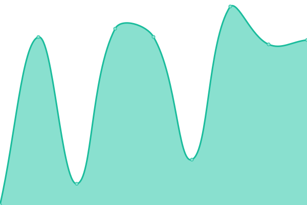

# [📈 Live Status](https://status.transport.miaguila.com): <!--live status--> **🟩 All systems operational**

This repository contains the open-source uptime monitor and status page for [Mi Aguila](miaguila.com), powered by [Upptime](https://github.com/upptime/upptime).

With [Upptime](https://upptime.js.org), you can get your own unlimited and free uptime monitor and status page, powered entirely by a GitHub repository. We use [Issues](https://github.com/MyEagle-Transport/status/issues) as incident reports, [Actions](https://github.com/MyEagle-Transport/status/actions) as uptime monitors, and [Pages](https://status.transport.miaguila.com) for the status page.

<!--start: status pages-->
<!-- This summary is generated by Upptime (https://github.com/upptime/upptime) -->
<!-- Do not edit this manually, your changes will be overwritten -->
<!-- prettier-ignore -->
| URL | Status | History | Response Time | Uptime |
| --- | ------ | ------- | ------------- | ------ |
|  [Admin Frontend](https://admin.transport.miaguila.com/) | 🟩 Up | [admin-frontend.yml](https://github.com/MyEagle-Transport/status/commits/HEAD/history/admin-frontend.yml) | 

 159ms
     
 | 

<a href="https://status.transport.miaguila.com/history/admin-frontend">100.00%</a>
    

|  [Client Frontend](https://client.transport.miaguila.com/) | 🟩 Up | [client-frontend.yml](https://github.com/MyEagle-Transport/status/commits/HEAD/history/client-frontend.yml) | 

 169ms
     
 | 

<a href="https://status.transport.miaguila.com/history/client-frontend">100.00%</a>
    

|  [Admin Api](https://admin.api.transport.miaguila.com/) | 🟩 Up | [admin-api.yml](https://github.com/MyEagle-Transport/status/commits/HEAD/history/admin-api.yml) | 

 247ms
     
 | 

<a href="https://status.transport.miaguila.com/history/admin-api">99.45%</a>
    

|  [Client Api](https://client.api.transport.miaguila.com/) | 🟩 Up | [client-api.yml](https://github.com/MyEagle-Transport/status/commits/HEAD/history/client-api.yml) | 

 225ms
     
 | 

<a href="https://status.transport.miaguila.com/history/client-api">99.68%</a>
    

|  [Driver Api](https://driver.api.transport.miaguila.com/) | 🟩 Up | [driver-api.yml](https://github.com/MyEagle-Transport/status/commits/HEAD/history/driver-api.yml) | 

 252ms
     
 | 

<a href="https://status.transport.miaguila.com/history/driver-api">100.00%</a>
    

|  [Fuecs api](https://fuecs.api.transport.miaguila.com/api/v1/pdf) | 🟩 Up | [fuecs-api.yml](https://github.com/MyEagle-Transport/status/commits/HEAD/history/fuecs-api.yml) | 

 215ms
     
 | 

<a href="https://status.transport.miaguila.com/history/fuecs-api">99.58%</a>
    

<!--end: status pages-->

[**Visit our status website →**](https://status.transport.miaguila.com)

## 📄 License

- Powered by: [Upptime](https://github.com/upptime/upptime)
- Code: [MIT](./LICENSE) © [Mi Aguila](miaguila.com)
- Data in the `./history` directory: [Open Database License](https://opendatacommons.org/licenses/odbl/1-0/)
